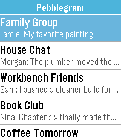
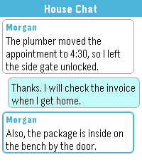
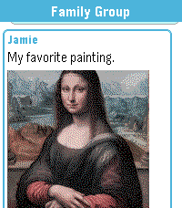
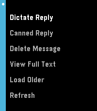

# Pebblegram

Pebblegram brings Telegram to Pebble watches through a small self-hosted bridge. The watch app gives you a fast inbox, readable message threads, inline photo previews, canned replies, and dictation replies while keeping Telegram credentials off the watch and phone.






## Downloads

- [Download the Pebble app PBW](release/Pebblegram.pbw)
- [Download the helper service ZIP](release/pebblegram-helper.zip)

The PBW installs on the watch. The helper ZIP runs the Telegram bridge on your own computer, home server, or VPS.

## What It Does

- Shows recent Telegram chats with unread state and message previews
- Opens one-on-one chats and regular groups
- Displays incoming and outgoing chat bubbles
- Loads inline photo previews
- Sends replies with Pebble dictation
- Sends configurable canned replies
- Loads older messages on demand
- Supports Basalt, Diorite, Emery, and Gabbro builds
- Includes a black-and-white optimized Diorite image path
- Includes round-screen layout handling for Gabbro

Pebblegram intentionally uses a bridge service because Telegram does not provide a direct Pebble-friendly API. The bridge talks to Telegram with Telethon, exposes a small HTTP API, and serves the phone-side PebbleKit JS runtime.

## Quick Start

1. Install [release/Pebblegram.pbw](release/Pebblegram.pbw) with the Pebble/Rebble mobile app.
2. Download and unzip [release/pebblegram-helper.zip](release/pebblegram-helper.zip).
3. Run setup from the unzipped helper folder.

macOS/Linux:

```sh
sh setup.sh
```

Windows PowerShell:

```powershell
.\setup.ps1
```

Setup asks for your Telegram API ID, API hash, and phone number, then prints a bridge token. Telegram may ask for a login code the first time.

After setup, start the helper in the background:

macOS/Linux:

```sh
sh start.sh
```

Windows PowerShell:

```powershell
.\start.ps1
```

Open Pebblegram settings in the Pebble mobile app and enter:

- Bridge URL: a URL your phone can reach, such as `http://192.168.1.50:8765` or `https://your-domain.example`
- Bridge token: the token printed by setup

Do not expose the helper service to the public internet without a bridge token.

## Development

Install the Pebble SDK/tooling, then build:

```sh
pebble build
```

Run mock mode for emulator testing without Telegram credentials:

```sh
python3 tools/bridge.py --mode mock --host 127.0.0.1 --port 8765
pebble install --emulator emery build/Pebblegram.pbw
```

Run Telegram mode directly:

```sh
export TELEGRAM_API_ID=12345
export TELEGRAM_API_HASH=your_api_hash
export TELEGRAM_PHONE=+15551234567
export TELEGRAM_ALLOW_READ_CONTENT=1
export TELEGRAM_ALLOW_SEND=1
export TELEGRAM_ALLOW_DELETE=0
export PEBBLEGRAM_TOKEN=$(python3 -c 'import secrets; print(secrets.token_hex(24))')
python3 tools/bridge.py --mode telegram --host 0.0.0.0 --port 8765
```

Docker deployment details are in [docs/docker.md](docs/docker.md).

## Project Structure

- `src/c/Pebblegram.c`: watch UI, AppMessage handling, scrolling, image decoding, actions, dictation
- `src/pkjs/index.js`: PebbleKit JS bridge between the watch and helper service
- `src/pkjs/config.html`: settings page served by the helper
- `tools/bridge.py`: mock and Telegram HTTP bridge
- `tools/docker_entrypoint.py`: first-run Docker setup flow
- `resources/images/menu_icon.png`: launcher/app-list icon bundled into the PBW
- `store/screenshots/`: store listing screenshots
- `release/`: packaged PBW and helper ZIP

## Security Notes

The helper service has access to your Telegram account through your local Telethon session. Treat it like account software:

- Use a bridge token for any non-local deployment.
- Prefer HTTPS for remote access.
- Do not commit `data/`, `.env`, Telegram session files, ngrok configs, or bridge tokens.
- Message sending is enabled by default; deletion is disabled by default.

## Status

Pebblegram is a community V1. The core flows work, but the code is intentionally simple and approachable so contributors can improve watch-specific layout, bridge deployment, and message features over time.
