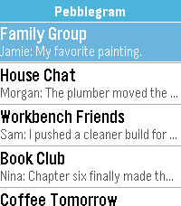
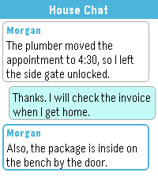
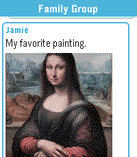
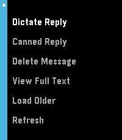

# Pebblegram

Pebblegram brings Telegram to Pebble watches with a PebbleKit JS Telegram client. The watch app gives you a fast inbox, readable message threads, inline photo previews, canned replies, and dictation replies without a separate companion service.






## Download

- [Download Pebblegram 3.6 PBW](https://github.com/TomBolger/Pebblegram/releases/download/v3.6.0/Pebblegram.pbw)

## What It Does

- Shows recent Telegram chats with unread state and message previews
- Opens one-on-one chats, regular groups, and pinned/foldered chat lists
- Displays incoming and outgoing chat bubbles
- Loads inline photo previews, GIF/video still previews, and text link previews
- Sends replies with Pebble dictation
- Types messages, replies and edits with an on-screen keyboard on touch watches (Pebble Time 2, Round 2)
- Supports tap, hold, drag and swipe-back touch gestures on touch watches
- Sends configurable canned replies
- Sends emoji replies
- Sends, updates, and removes Telegram reactions
- Replies to, forwards, edits, and deletes messages from the watch
- Loads older messages on demand
- Keeps open chats and the chat list refreshed while the app is running
- Supports Basalt, Diorite, Flint (Pebble 2 Duo), Emery, and Gabbro builds
- Includes a black-and-white optimized Diorite image path
- Includes round-screen layout handling for Gabbro

## Changes Since 3.5

Pebblegram 3.6 fixes login and reply bugs, brings back the on-screen keyboard, and adds much wider emoji support.

### Fixes

- Fixed canned replies and voice replies sending an empty message on Basalt, Diorite and Pebble 2 Duo (#11).
- Fixed login on the Core Devices phone apps: Telegram now connects over encrypted `wss://` by default (#4, #7, #10).
- Fixed "Maximum reconnection retries reached" after entering the login code, caused by sign-in being sent to the wrong Telegram data center (#4, #9).
- Fixed iOS login hanging on "Requesting Telegram login..." by no longer replacing the phone app's WebSocket (#7, #8).
- Fixed two-step (cloud password) login looping back to the password prompt (#6).
- The login code cooldown now starts only after Telegram actually sends a code, and the watch says where the code was sent (Telegram app, SMS, call).

### Emoji

- Much wider emoji support: on PebbleOS 4.29 and newer, all ~1,400 emoji the watch fonts include now show as emoji in messages, chat names, stickers and reactions. Anything the watch can't draw shows as its name, like `:partying_face:` or `:flag_de:`, instead of a generic `:emoji:`. Older firmware keeps its smaller set and names the rest.
- The React menu now offers every Telegram standard reaction your watch can draw (69 on PebbleOS 4.29+), and the Emoji reply menu has 84 choices. Messages can show up to six reactions, and Premium custom-emoji reactions show the emoji they stand for.

### Keyboard (Pebble Time 2 and Round 2)

- The on-screen touch keyboard is back and reworked. Tap "New message" at the bottom of a chat, or pick Keyboard from the Select menu.
- No dead spots between keys. The key under your finger lights up, and a big preview of the letter pops up well above your finger so you can see it; slide to correct before letting go.
- Holding delete keeps deleting. Sentences are capitalised automatically; double-tap the shift arrow for caps lock. A second symbols page is available.
- The text box scrolls so you can always see what you're typing, and on Round 2 the keys fit inside the circle.
- Drafts survive menus and the Back button ("Continue draft"). A failed send is marked "not sent" and your text comes back.
- New menu options: Keyboard, Type Reply, and Edit by Keyboard. Voice stays at the top of the menu.

### Touch (Pebble Time 2 and Round 2)

- Tap a chat to open it; hold a chat for Archive/Delete/Mute/Mark as Unread; drag to scroll the list.
- In a chat, drag to scroll (pull down at the top to load older messages), tap a message for its menu, hold a message to react, and swipe right to go back.
- In the full-message view, drag to scroll and swipe right to close.
- Pop-up menus (Reply, React, Canned Message, Emoji, chat actions) respond to touch through PebbleOS touch navigation; turn it on in the watch's Settings if taps in menus don't work. On touch watches the React and Emoji menus are a one-per-row list so every tap picks exactly the emoji you touched.
- The buttons still work exactly as before.

### Other

- Added a native Pebble 2 Duo (Flint) build.
- Pebble Time 2 and Round 2 now need PebbleOS 4.32 or newer (for touch in menus). Pebble Time, Time Steel, Pebble 2 and Pebble 2 Duo install on the same watch software as 3.5.

Thanks to @SimonIlic (#8) and @twodotwill (#9) for tracking down the login bugs.

## Quick Start

1. Install [Pebblegram 3.6 PBW](https://github.com/TomBolger/Pebblegram/releases/download/v3.6.0/Pebblegram.pbw) with the Pebble/Rebble mobile app.
2. Open Pebblegram settings in the Pebble mobile app.
3. Enter your Telegram API ID, API hash, and phone number.
4. Save once to request a Telegram login code.
5. Reopen settings, enter the login code, and save again.
6. If Telegram asks for two-step verification, reopen settings, enter your Telegram cloud password, and save again.

Create Telegram API credentials at [my.telegram.org/apps](https://my.telegram.org/apps).

## Development

Install the Core Devices Pebble tool (`uv tool install pebble-tool`, then `pebble sdk install latest`), then build:

```sh
pebble build
```

Build the bundled Telegram client:

```sh
npm install
npm run build:pgjs-gramjs
```

For local testing with embedded API credentials, keep them in an ignored environment file such as `.env.pgjs.local`, then source it before building the bundle. Do not commit personal API credentials, Telegram sessions, or generated PBWs that contain credentials.

## Project Structure

- `src/c/Pebblegram.c`: watch UI, AppMessage handling, scrolling, image decoding, actions, dictation
- `src/pkjs/index.js`: PebbleKit JS runtime and watch communication
- `src/pkjs/config.html`: Pebble settings page
- `src/pkjs/pgjs/`: Telegram client, auth, settings storage, and image processing
- `resources/images/menu_icon.png`: launcher/app-list icon bundled into the PBW
- `store/screenshots/`: store listing screenshots
- `release/`: packaged PBW

## Security Notes

- Do not commit `.env`, `.env.*`, Telegram session files, generated personal PBWs, ngrok configs, or account tokens.
- Public release builds must not embed a personal Telegram API ID or API hash.
- Telegram API ID/hash are required by Telegram's MTProto API. The public PBW does not embed a personal API ID/hash.

## Status

Pebblegram 3.6 is the current direct Telegram build. The core flows work, but this is still community software for an unsupported watch platform.
